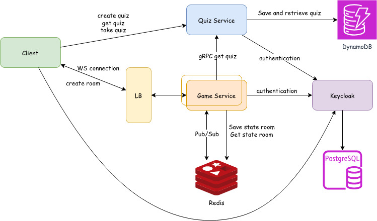
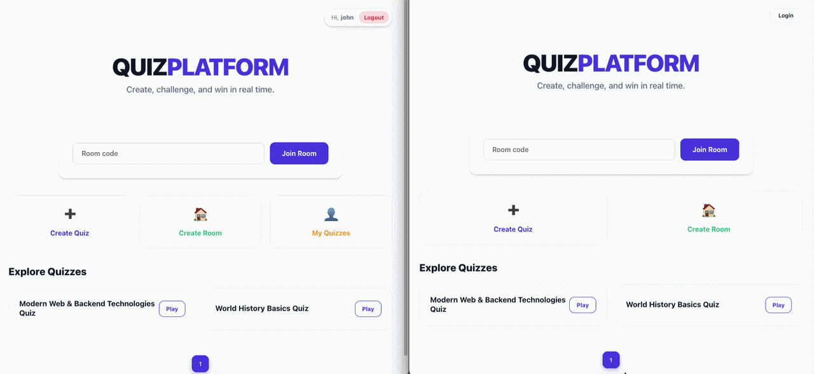

# Real-Time Quiz Platform


A real-time multiplayer quiz platform where users can create, join, and compete in interactive challenges. Built with a distributed microservices architecture to handle persistent quiz data and low-latency game states.

## Key features
- **Multiplayer Rooms**: Join live sessions via WebSockets for a synchronized gaming experience.

- **Solo Mode**: Practice quizzes individually at your own pace.

- **Quiz Creator**: Registered users can design and save custom quizzes.

- **Hybrid Auth**: Seamless access for both registered users and anonymous guests.

## Architecture Diagram
<p align="center">
    
</p>

The system is designed as a distributed set of services:

**Quiz Service**: A Python (FastAPI) service that manages the lifecycle of quizzes (CRUD), persisting data in MongoDB.

**Game Service**: The core engine for multiplayer logic. It handles WebSocket connections for real-time interaction and uses Redis Pub/Sub to synchronize state across multiple instances.

**Identity Provider**: Keycloak (backed by PostgreSQL) manages user identity, ensuring secure access to the creator dashboard.

**Load Balancer (NGINX)**: Orchestrates incoming traffic, distributing WebSocket and HTTP requests to the appropriate service instances.

## Tech Stack

**Frontend:** React with TypeScript

**Backend:** Python & FastAPI for high-performance asynchronous endpoints.

**Inter-service Communication:** gRPC for efficient, low-latency communication between the Game and Quiz services.

**Real-time:** WebSockets for bi-directional client-server communication.

**MongoDB**: Scalable NoSQL for quiz storage.

**Redis**: In-memory store for game session state and real-time messaging.

**PostgreSQL**: Relational storage for Keycloak identity data.

## Technical Decisions
**gRPC vs REST**: Using gRPC for internal service communication (Game Service → Quiz Service) allows to reduce overhead and benefit from strict Protobuf contract definition.

**Redis for State Management**: Since game rooms are highly volatile, Redis provides the sub-millisecond latency required to track game status.

**WebSocket Scaling**: NGINX acts as a reverse proxy to handle WebSocket upgrades and maintain persistent connections between the Client and the Game Service.

**CI**: Automated pipeline via GitHub Actions that runs Linter and Unit Tests on every push, ensuring code quality and coverage for the backend.

## Running the Application

### Prerequisites
- Docker  
- Docker Compose  

### Setup

1. Create a `.env` file in the project root and configure Keycloak and PostgreSQL credentials:
   ```env
   POSTGRES_USER=username
   POSTGRES_PASSWORD=password

   KEYCLOAK_ADMIN=admin
   KEYCLOAK_ADMIN_PASSWORD=password
   ```
2. Launch the full application:
   ```bash
   docker compose up -d
   ```
Once running, the web interface will be available at: **http://localhost:8080**

## Using the Application

Start by creating a new quiz room or joining an existing one using a room code. Once inside, participants are automatically connected through a WebSocket session that keeps the game state synchronized in real time.

When the host starts the quiz, questions are broadcast simultaneously to all connected players. Each participant can select an answer, and the system immediately processes and updates responses across all clients without requiring page refreshes.

This demo showcases real-time multiplayer synchronization, where both question delivery and score updates are handled instantly.

<p align="center">

</p>
